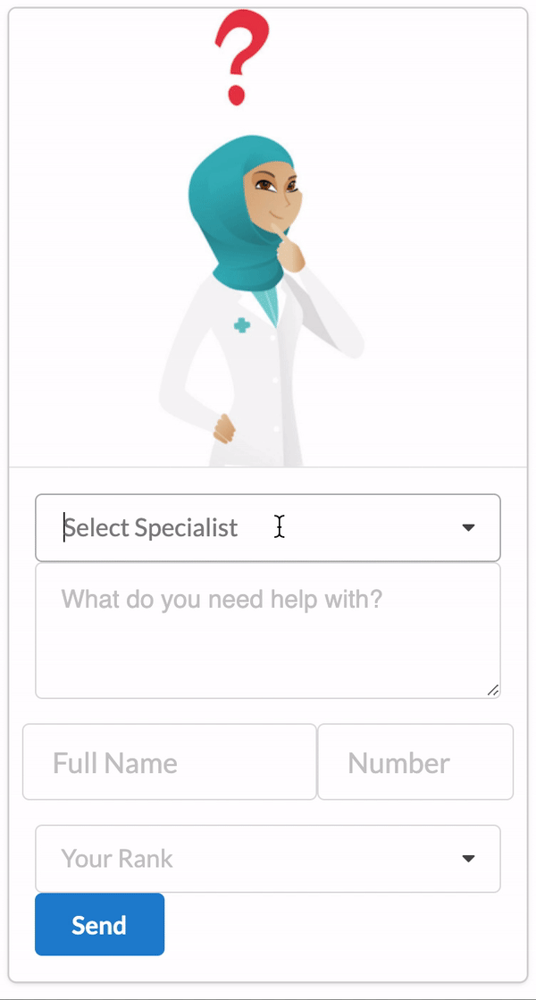
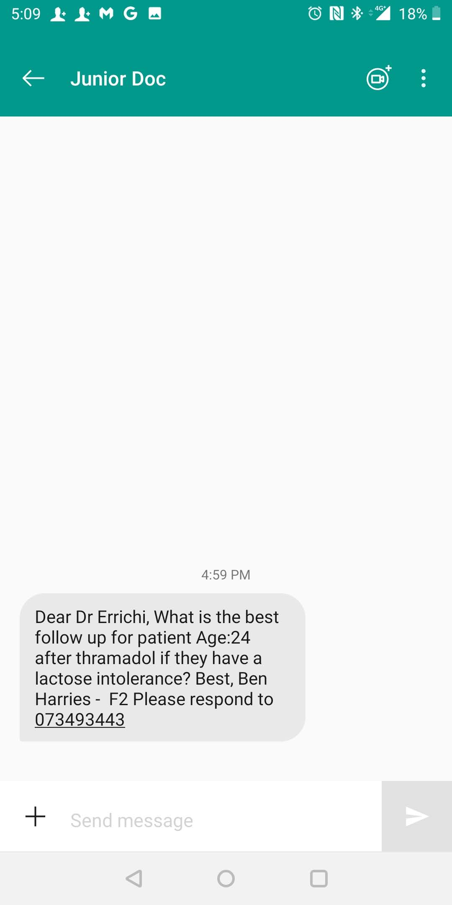

Front end in React.js
Backend in node-red

# Demo

Results in

Demonstrating that a junior (doctor) in a remote area of the world could send a message routed to the correct specialist volounteer.

The specialist recipient would reply on SMS and following a set amount of queries they would respond do a week for example.
